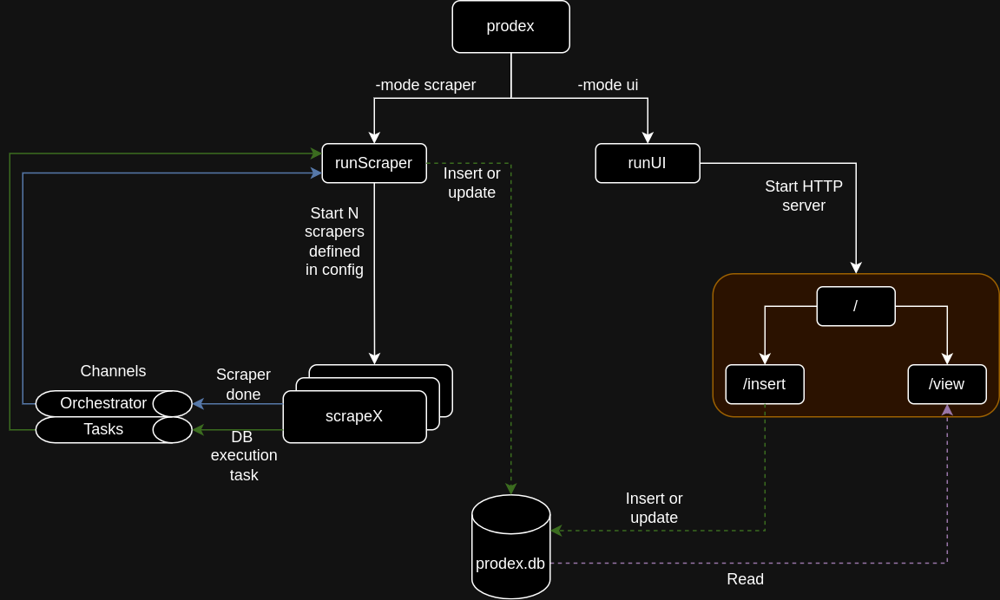

# Prodex - Productivity Index

A small lightweight application designed to scrape some basic metrics about work performance.
Designed to "lighten the load" of manually keeping track of all the work that you have done.


## Requirements
- systemd
- sqlite3


## Installation
Clone the repository and run the following from the project root:
```bash
make install
```
This will build the binary and install as a systemd service for the user (not root).
Two services are installed as a result:
- prodex.service (along with prodex.timer)
- prodexui.service

:warning: By default, the scraper will run on an hourly basis. If you would like to modify this
behaviour, you need to modify `./dev/prodex.timer` BEFORE running make install.

To uninstall, you can also run:
```bash
make uninstall
```

## Usage
### Scraper
After installation, the scraper is set to run hourly. There should be no need to modify this.
Any configuration changes made should be applied on the following run.

#### Viewing the logs of the scraper
```bash
journalctl --user-unit prodex
```

### UI
Currently, only a very basic web server is available on port `localhost:8642` that doesn't do a lot
of anything.

I will soon write a web UI that will make it easier to interact with the scraped data,
but in the meantime, you are able to query the database directly using a tool such as
nvim-dadbod or dbbrowser for sqlite3. The DB is located under `~/etc/prodex/db/prodex.db`.


## How it works
Two modes are available for prodex.
- Scraper
    This is the primary means of retrieving data and storing it in the DB.
    More TODO
- UI
    This is the primary means of viewing the data, but also provides a way to interact
    with user defined custom tables, for anything that needs recording but doesn't have
    an associated scraper (e.g. events organised).
    More TBD on how these tables will be created.




## Configuration
All scrapers are configured using the `prodex.toml` file. This file is located at the following
path `~/.config/prodex/prodex.toml` after installation.

### Base configurations
- Required Properties
    - installation_path
        Generally, this shouldn't be modified. The only time it should be
        modified is when you are installing in a different location to that
        in the Makefile.
    - log_level
        Any of ["debug", "info", "warn", "error"]
    - max_noops
        This determines how many noops can happen before the scraper stops.
        It is intended to stop the scraper running indefinitely.

Specific configurations are detailed under each available scraper below.

### Available scrapers
- Jira
    - What does it do?
        - Retrieves and stores every Jira issue where you are `assignee`
        - Retrieves and stores every Jira issue where you are `reporter`
        - Retrieves and stores every Jira issue where you are `creator`
    - Required Properties
        - atlassian_token
            The token for your Atlassian instance.
            Can be generated at https://id.atlassian.com/manage-profile/security/api-tokens
        - atlassian_user
            Your username/email for the Atlassian instance.
        - atlassian_domain
            The domain for the Atlassian instance.
            Note it must begin with the scheme of the URL (most probably https://)
        - pagination_size
            The number of documents to retrieve in a single API call.
    - Example
        ```toml
        [[scrapers.jira]]
        atlassian_token = "abcdefg"
        atlassian_user = "your-email@email.email"
        atlassian_domain = "https://your-atlassian-url.atlassian.net"
        pagination_size = 50
        ```
- Confluence (not working currently)
    - What does it do?
    - Required Properties
        - atlassian_token
            The token for your Atlassian instance.
            Can be generated at https://id.atlassian.com/manage-profile/security/api-tokens
        - atlassian_user
            Your username/email for the Atlassian instance.
        - atlassian_domain
            The domain for the Atlassian instance.
            Note it must begin with the scheme of the URL (most probably https://)
    - Example
        ```toml
        [[scrapers.confluence]]
        atlassian_token = "abcdefg"
        atlassian_user = "your-email@email.email"
        atlassian_domain = "https://your-atlassian-url.atlassian.net"
        ```
- Confluence (not working currently)
    - What does it do?
    - Required Properties
        - github_token
            TODO
        - github_url
            TODO
    - Example
        ```toml
        [[scrapers.github]]
        github_token = "hijklm"
        github_url = "https://api.github.com/"
        ```

### Contributing
TODO
